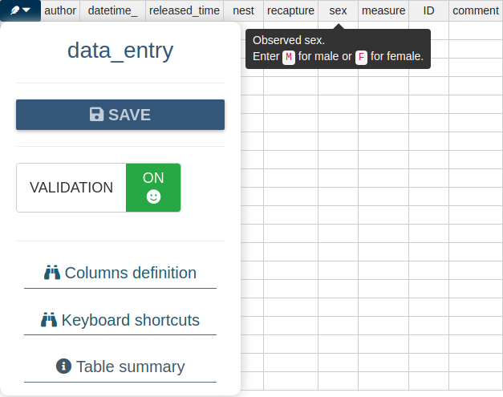

[](https://travis-ci.org/mpio-be/DataEntry)

DataEntry: Data Entry interfaces.
------------


The data entry backend is a `MariaDB` database so more people can enter data simultaneously. 
The frontends are UI-s (one per table) based on [shiny](https://cran.r-project.org/package=shiny) and [rhandsontable](https://cran.r-project.org/package=rhandsontable).

Individual checks are done by `validators`.
A collection of  `validators` makes an `inspector`.  Data is checked *before* it is saved to the DB by the  `inspector`. 
Each time the `inspector` runs, the *exact* position of the offending cell(s) and the reasons for errors are returned. 

For example: 

   
Given that `test` DB exists (see `system.file('UI', '.testdb.R', package = 'DataEntry')`)
this UI can be run with: 

``` R
ui = system.file('UI', 'newData', package = 'DataEntry')
shiny::runApp(ui, launch.browser = TRUE)
```


Installation
------------
``` R

install.packages("devtools")
devtools::install_github("mpio-be/DataEntry")

```

